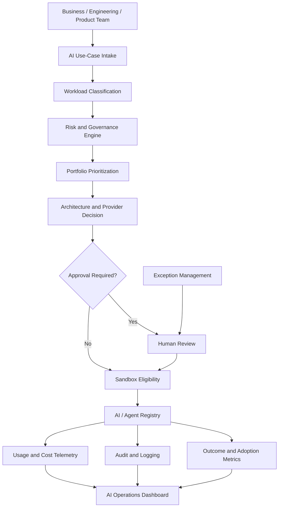

# Enterprise AI Operations Control Plane

Enterprise AI Operations Control Plane is a working reference architecture for operating AI as a governed enterprise capability, combining use-case intake, portfolio prioritization, model and agent governance, risk-based approvals, exceptions, cost visibility, adoption metrics, and executive oversight.

The project demonstrates the operating layer required between AI experimentation and scaled enterprise adoption. It focuses not only on what AI systems can build, but on how organizations decide what should be built, who may use which models, how risk is reviewed, how costs are allocated, how agents are registered, and how value is measured.

> Reference architecture / working prototype / AI operating-model implementation — not a commercial product.

---

## Why AI Operations Exists

Enterprises often begin with untracked subscriptions, duplicate use cases, unclear ownership, unknown costs, and informal agent deployment. AI Operations provides a consistent lifecycle so initiatives can be classified, risk-reviewed, approved, measured, and retired with evidence.

---

## What This Demonstrates

| Capability | Demonstration |
| ---------- | ------------- |
| Intake | Structured AI use-case intake |
| Portfolio | Value/risk prioritization |
| Governance | Policy-driven decisions |
| Models | Approved provider/model registry |
| Agents | Enterprise agent registry |
| Risk | Risk classification + controls |
| Approval | Human approval workflow |
| Exceptions | Time-bound exception process |
| Sandbox | Simulated controlled experimentation |
| Cost | AI spend allocation and budget alerts |
| Telemetry | Structured operating events |
| Adoption | Enterprise AI adoption metrics |
| Executive visibility | Portfolio dashboard |

---

## Architecture



---

## Quick Start

Requirements: Python 3.12+

```bash
git clone https://github.com/prendleman/enterprise-ai-operations-control-plane.git
cd enterprise-ai-operations-control-plane
make setup
make demo
```

Windows PowerShell:

```powershell
python -m pip install -e ".[dev]"
python scripts/seed_data.py
python scripts/demo.py
```

No API keys required. Default provider is `mock`.

| Command | Purpose |
| ------- | ------- |
| `make test` | pytest + coverage |
| `make lint` / `make typecheck` | ruff / mypy |
| `make api` | FastAPI `:8000` |
| `make dashboard` | Streamlit `:8501` |
| `make validate` | repo + readiness score |

---

## Demo

`python scripts/demo.py` walks through:

1. Good internal knowledge-assistant candidate  
2. Agentic checklist workflow with human review  
3. Budget warning at ~85% utilization  
4. Unapproved model + confidential data → blocked / exception  
5. Unsafe autonomous finance agent → CRITICAL / NOT APPROVED  

---

## AI Use-Case Lifecycle

`IDEA → INTAKE → CLASSIFY → PRIORITIZE → RISK REVIEW → ARCHITECTURE → APPROVAL → SANDBOX → PILOT → MEASURE → PRODUCTION ELIGIBILITY → OPERATE → REVIEW/RETIRE`

---

## Portfolio Prioritization

Scores (0–100) combine business value, strategic alignment, effort, risk, reusability, users, cost fit, and time-to-value. Bands: PRIORITY / PILOT CANDIDATE / BACKLOG / DEFER. This is **decision support**, not a replacement for executive judgment.

---

## Governance Model

Executable YAML-backed policy: tool/model allowlisting concepts, risk-based approvals, CRITICAL blocking, and exception requirements. See `config/policies.yaml` and `config/risk_rules.yaml`.

---

## Model Registry

Includes Bedrock-style fields (provider, model ID, region, workloads, restricted data, cost class, human review, status) as **configuration modeling** — not a claim that AWS is provisioned.

---

## Agent Registry

Tracks autonomy (`ASSIST`, `RECOMMEND`, `ACT_WITH_APPROVAL`, `BOUNDED_AUTONOMY`), tools, write capability, and human review. Unrestricted write autonomy without review is rejected.

---

## Sandbox Model

Simulated eligibility for approved experimentation with budget ceilings, allowed data classes, logging, and duration constraints.

---

## Cost & Usage Governance

Simulated allocation by business unit, use case, provider, model, and month with 80/100/120% alerts. Production integration points: AWS Cost Explorer/Bedrock usage, Azure Cost Management, OpenAI exports, FinOps tooling.

---

## Exception Management

First-class time-bound exceptions with compensating controls and expiry.

---

## Executive Dashboard

`streamlit run dashboard/app.py` — portfolio, cost, governance, agents, adoption.

---

## Operating Model

- `docs/ai-operations-charter.md`
- `docs/decision-rights.md`
- `docs/mvp-roadmap.md`
- `docs/adoption-framework.md`
- `docs/production-readiness.md`

---

## Repository Structure

```text
app/           # API, intake, governance, portfolio, registries, costs, telemetry
config/        # models, policies, risk rules
dashboard/     # Streamlit executive views
docs/          # charter, ADRs, adoption, readiness
scripts/       # seed, demo, validate
tests/         # pytest suite
.github/       # CI, security, templates
```

---

## Architecture Decisions

ADRs 0001–0006 cover the control plane, risk-based approval, model registry, cost attribution, agent registration, and exception expiration.

---

## Security

This reference implementation is **not** a production security boundary.

It does **not** implement real IAM, production secrets management, AWS Organizations, actual Bedrock provisioning, real billing ingestion, enterprise SIEM, network segmentation, or production DLP.

---

## Limitations

- Provider adapters beyond `mock` are integration points
- Costs, sandboxes, and portfolio volumes use synthetic/simulated data
- Productivity/outcome metrics in seeds are labeled synthetic
- No live cloud accounts required or used by default

---

## Roadmap

Wire OIDC identities, compile YAML to OPA/Cedar, ingest real billing exports, and connect production change-management systems.

---

## License

MIT
