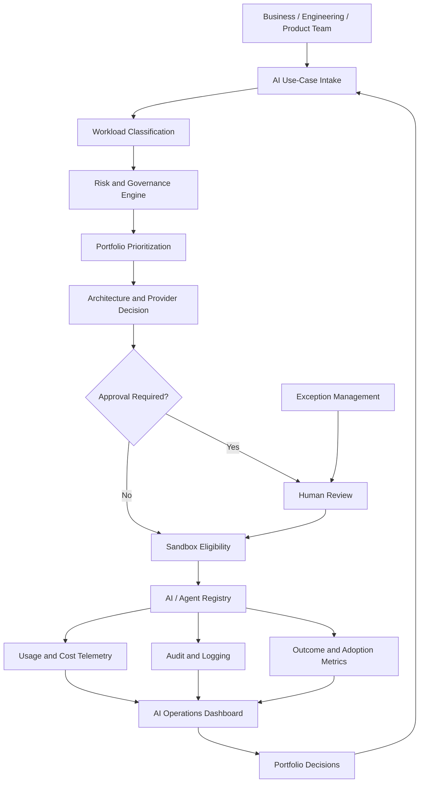

# Architecture

## Problem statement

Enterprises often accumulate disconnected AI experiments without shared intake, risk review, model governance, cost attribution, or portfolio oversight. This control plane demonstrates a target operating layer between experimentation and scaled adoption.

## System context

Local-first reference implementation. Default provider is `mock`. AWS Bedrock and other providers appear as **configuration-modeled governance concepts**, not live cloud provisioning.

## Components

| Component | Role |
| --------- | ---- |
| Intake | Structured use-case capture |
| Classifier | Workload recommendation |
| Risk engine | Risk score, factors, controls |
| Prioritization | Decision-support portfolio score |
| Policy engine | Approval / block / exception requirements |
| Model registry | Approved/unapproved provider-model catalog |
| Agent registry | Agent inventory with autonomy limits |
| Sandbox service | Simulated experimentation eligibility |
| Exceptions | Time-bound exception workflow |
| Cost telemetry | Simulated spend + budget alerts |
| API / Dashboard | Operator and executive interfaces |

## Control flow

## Trust boundaries

- No production IAM, vault, SIEM, or cloud billing ingestion
- Policy decisions are executable in-process against YAML config
- Sandbox/cost/GitHub-style cloud controls are simulated and labeled

## Limitations

Not a production security boundary. Does not provision Bedrock, ingest real invoices, or enforce network segmentation.
